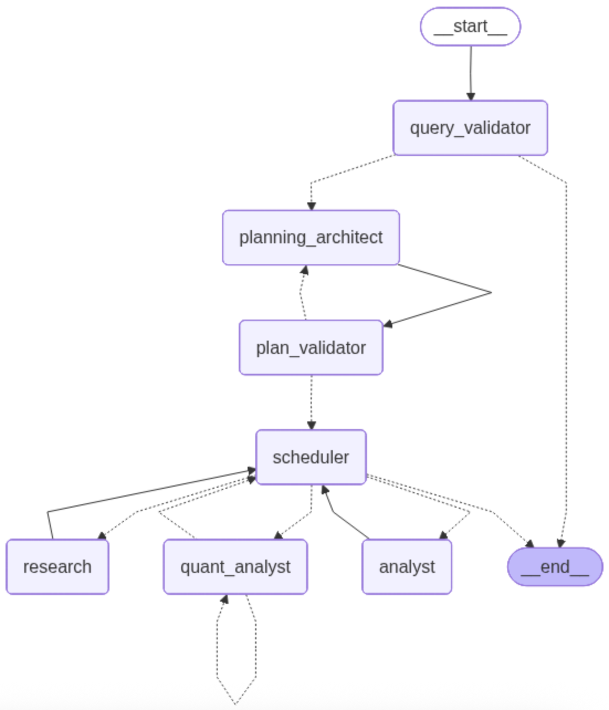

## Problem
Automate investment research using agentic AI
Input: 
- User Query → Analyze NVIDIA and produce an investment research summary
- Topic → Investment Report

Output: 
- A markdown report with analysis and charts

## Architecture
It follows Ochestrator-Worker (a version of Hierarchical structure) design
- Ochestrator agent
    - Planner → DAG
    - Scheduler → routes tasks
- Research agent → web search tool → MCP server 
- Quant agent → generates Python
- MCP sandbox → executes code
- Auditor → validates Quant agent results (reflection loop)
- Analyst → produces final markdown report

I used LangGraph for implementation. 

### Supervisor

1. User Query Validator
User query is first validated for safty, clareance and relevance to the topic. This is done by a small model. If not passed, the user is aske to edit the query (HITL). After maximum number of iteration of failures, graph ends.

2. Orchestrator
It consists of a Planner agent and a Scheduler. The planner is a high reasoning model that receives user query based on which it creates a plan of dependent tasks for worker agents to operate the plan. This plan is a DAG of tasks designed for Researcher, Qaunt Analyst and Analyst agents which must respect the dependecies. This plan is saved in `plan` field of teh graph stage ad a list of Tasks Pydantic schemas.

    Right after plan is created, it is verified against some measure:
    - Is a valid DAG? Otherwise orchestrator is trapped in an infintie loop.
    - Are dependecies unique? or any missing? 

    If the plan is valid, it is sent to the scheduler to be distributed among agents. 

3. Scheduler
It checks tasks status: If all its dependencies are completed, the task status changes from `pending` to `ready` and then `running`. All the `running` task are dispatched to specilaist agents using `Send` command. Agents can only change the status of their tasks to `completed` or `failed` when the task returns to the scheduler. After tasks returned to the schduler and failed, schduler could retry or escalade to a human in the loop. When all tasks are in `completed` status, the graph ends and the final report is delivered. 

### Research Agent
This agent's job is to gather fresh data from the web or retreive documents for database. In this application, it only performs web search using **MCP tools**. It summarizes information into the researcher artifacts.

- Tools: **Tavily Search** or DuckDuckGo are great for structured research.
- Strategy: This agent might recieve multiple independent tasks from the scheduler for multiple searches from different angles (e.g., competitors, financials, recent news) which will be conducted in parallel. Then the result will be summarized and saved into the researcher's artifact. 

### Quant subgraph
This subgraph consists of Quant agent, a deterministic validator and the Auditor agent.

#### Quant Analyst
Quant agent implements Program-Aided Language (PAL) Models. It is the "Calculation" agent that should never "hallucinate" math; it should write and run code instead. It can run data analytics 

- Tools: A Python REPL or Sandbox environment provided via an MCP server 
- Environment (Quant Sandbox): Uses Modal Sandboxes to execute untrusted code safely without crashing the main graph
- Role: Transforms raw financial statements from the Research agent into visualizations, charts, or complex ratio analyses. It can run Monte Carlo simulations, data analytics tools to provide quantitative support for the final report.  

#### Auditor
Perform self-reflection task. Checks for hallucinations, logical or runtime errors, descrepany, and provides feedback. Judges the results from Quant node for required outputs, validity of code and data used in the code, descrepencies betwwen the results from Quant agent and research data. PASS or FAIL if requirements not met.

If failed, the task will be returnrd to the Quant Agent with the feedback from Auditor
- This cycle repeats for a MAX_ITERATION allowed
- After max retires reached, the task is marked failed by Auditor and returned to the scheduler

### Analyst
The Analyst produces a "Candidate Report". The analyst doesn't search; it "thinks" over the gathered data.

- Strategy: Use a "Chain of Thought" prompt to ensure it doesn't skip steps when transforming raw data into investment insights.
- Role: Acts as the data scientist's assistant, looking for underlying trends and risks.

The final report in markdown provides insight into the investment the user is asking for.

### run it

