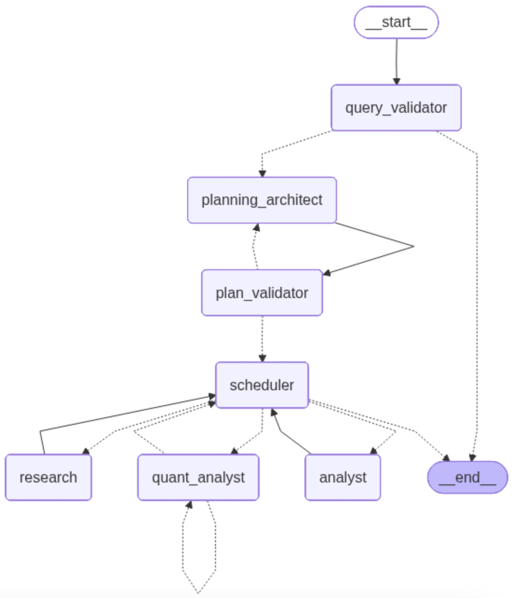

# Agentic Investment Research

Production-oriented multi-agent system for automated equity research: planning, web research, quantitative analysis, audit loops, and final report synthesis.

**Example:** *“Research Microsoft cloud revenue, run a quantitative growth analysis, and produce an investment report.”*  

**Output:** Markdown investment report backed by research artifacts and optional quant outputs (charts, simulations).

## Why this matters

Modern agent systems combine **reasoning**, **tools**, and **orchestration** instead of a single LLM call. This project mirrors that pattern:

- DAG-based task planning and parallel dispatch
- Tool-augmented agents (search + code sandbox via MCP)
- Reflection loops (quant auditor)
- Persistence (Postgres checkpoints) and offline evaluation

## Architecture

**Orchestrator–worker** design implemented with [LangGraph](https://github.com/langchain-ai/langgraph):

| Layer | Role |
|-------|------|
| **Query validator** | Safety / relevance gate (small model; HITL when not in eval mode) |
| **Planner** | User query → DAG of tasks per agent |
| **Plan validator** | Cycle / orphan / dependency checks |
| **Scheduler** | Dependency-aware dispatch; failed upstream tasks skip dependents (analyst may run on partial evidence) |
| **Research** | Web search via MCP → structured artifacts with `sources[]` URLs |
| **Quant subgraph** | PAL code generation → MCP sandbox → **auditor** retry loop |
| **Analyst** | Synthesizes evidence into a cited markdown report (`[^n]` + References) |



### Quant subgraph

- **Quant analyst** — writes Python, executes in Modal sandbox (MCP), no math hallucination in prose.
- **Auditor** — compares code/stdout to research; `PASS` / `FAIL` with bounded retries (`MAX_ITERATION`).
- **Routing** — `retry_count` is incremented on failed executions in node state (not only via routing). After `MAX_ITERATION`, the auditor marks the task failed and returns to the scheduler. Eval runs set `recursion_limit` as a backstop.

### Scheduler & failure handling

When an upstream task **fails**, the scheduler:

- Marks dependent tasks **failed** (skipped) with a clear `error_message`, **except**
- **Analyst** — still runs if **any** dependency completed (e.g. research succeeded but quant failed), so the report can state limitations instead of hanging or looping.

The graph terminates when every task is `completed` or `failed` (no indefinite scheduler cycles).

### Analyst & source citations

- Research artifacts include a `sources` list (URLs from structured extraction).
- `app/services/artifacts/evidence.py` builds a **SOURCE INDEX** for the analyst prompt.
- The final report must use inline citations `[^1]`, `[^2]`, … and a **## References** section.
- Upstream failures are listed in the prompt so the model does not invent numbers to replace missing quant/research output.

### Memory & persistence

- Short-term: graph state, messages, artifacts (reducers).
- Long-term: **Postgres checkpointer** — resume runs, crash recovery, per-`thread_id` isolation.

### MCP & API

- **MCPManager** — persistent sessions, cached tools, `asyncio.Lock` on startup (avoids `ClosedResourceError`).
- **FastAPI** — graph execution, SSE streaming, lifespan hooks for MCP + checkpointer.

---

## Offline evaluation

Benchmark-driven pytest suite under `evals/`. Cases live in `evals/datasets/benchmark.jsonl` (one JSON object per line).

### What each run checks

| Layer | Evaluator | Description |
|-------|-----------|-------------|
| **Deterministic** | `deterministic:*` | Query validity, DAG structure, plan agents, regex / length on report |
| **Workflow** | `required_agents` | Expected nodes in execution path (`auditor` → `quant_analyst` in trace) |
| **Infra** | `resilience` | Graph completed, no runaway steps (≤50), ≥1 MCP tool call |
| **Budget** | `budgets` | Graph-only cost, tokens, latency vs category/global rails |
| **Quality** | `llm_judge` | **Single** LLM call scoring four pillars (0–1): faithfulness, citation fidelity, consistency, completeness |

No per-case judge prompts — criteria are fixed in `evals/evaluators/llm_judge.py`. Cases only set `min_score` thresholds.

### Case format (example)

```json
{
  "id": "simple-001",
  "category": "simple_task",
  "input_query": "Summarize NVIDIA's latest quarterly revenue and key growth drivers.",
  "run_full_graph": true,
  "required_agents": ["research", "analyst"],
  "checks": {
    "deterministic": [
      { "type": "query_valid", "expected": true },
      { "type": "dag_valid", "expected": true },
      { "type": "plan_has_agent", "agent": "research" },
      { "type": "regex", "target": "final_report", "pattern": "(?i)revenue" }
    ],
    "llm": [
      { "metric": "faithfulness", "min_score": 0.7 },
      { "metric": "citation_fidelity", "min_score": 0.6 },
      { "metric": "consistency", "min_score": 0.7 },
      { "metric": "completeness", "min_score": 0.7 }
    ]
  }
}
```

Omit `checks.llm` to use **category defaults**. Omit `budgets` to use **global + category budget rails** (see `evals/evaluators/defaults.py`).

**Unit-only cases** (`run_full_graph: false`) — adversarial, ambiguous, synthetic DAG — run deterministic checks without live graph/MCP.

### Prerequisites

```bash
pip install -r requirements.txt

# Integration evals need MCP containers
docker compose up -d mcp-research mcp-quant
```

### Commands

```bash
# Fast — deterministic + DAG cases (~seconds)
pytest evals/ -m unit -v

# Integration — full graph + judge (needs API keys + MCP)
EVAL_MODE=1 pytest evals/ -m integration -v --run-integration

# One case
EVAL_MODE=1 pytest evals/ -m integration -v --run-integration --eval-case-id simple-001

# Several cases (recommended over full suite — avoids rate limits)
EVAL_MODE=1 pytest evals/ -m integration -v --run-integration \
  --eval-case-id simple-001 \
  --eval-case-id multi-001 \
  --eval-case-id missing-001 \
  --eval-case-id hall-001

# All graph cases (heavy — use delay)
EVAL_CASE_DELAY_SECONDS=15 \
  EVAL_MODE=1 pytest evals/ -m integration -v --run-integration --run-full-suite
```

Reports: `evals/reports/latest.txt` and `latest.json` (full `EvaluatorResult` list per case).

### Where to read evaluator results

| Location | Contents |
|----------|----------|
| `evals/reports/latest.json` | Full run: `evaluators[]` with `name`, `passed`, `score`, `explanation`, `details` |
| `evals/reports/latest.txt` | Aggregated success rate, faithfulness, budget failures |
| **Langfuse** (if keys set) | Per-case trace `offline_eval:<case_id>` with scores: `eval_case_passed`, `deterministic_*`, `llm_faithfulness`, etc. |
| Langfuse → **Datasets** | `investment_research_benchmark` — items synced from benchmark cases, linked via run name |

After each integration case, `evals/langfuse_export.py`:

1. Upserts a **dataset item** in `investment_research_benchmark` (case id, query, category).
2. Links the graph **trace** to a dataset **run** (`LANGFUSE_EVAL_RUN_NAME`, e.g. `offline_eval_local`).
3. Writes **scores** on the trace for every evaluator, plus per-metric LLM scores (`llm_faithfulness`, …).
4. Sets trace **output** to the full `evaluators[]` JSON (same shape as `latest.json`).

Configure in `.env`:

```bash
LANGFUSE_PUBLIC_KEY=...
LANGFUSE_SECRET_KEY=...
LANGFUSE_EVAL_DATASET=investment_research_benchmark
LANGFUSE_EVAL_RUN_NAME=offline_eval_local
```

Langfuse is useful here specially for regression: compare faithfulness and cost across runs in one UI, filter by tag `offline_eval`, and tie traces back to benchmark case IDs.

### Eval code layout

| Path | Role |
|------|------|
| `evals/evaluators/evaluate.py` | Runs all checks for one case |
| `evals/evaluators/deterministic.py` | `query_valid`, `dag_valid`, `regex`, … |
| `evals/evaluators/llm_judge.py` | Single-pass four-pillar judge |
| `evals/evaluators/budgets.py` / `resilience.py` | Infra rails (auto-applied on `run_full_graph`) |
| `evals/evaluators/defaults.py` | Global budget + default resilience + LLM thresholds |
| `evals/langfuse_export.py` | Push `EvaluatorResult` → Langfuse scores + dataset |
| `evals/test_cases/runner.py` | Executes graph, collects `EvalRunResult` |

### Recommended smoke matrix

| Case | Covers |
|------|--------|
| `simple-001` | Research + analyst, revenue regex, full LLM pillars |
| `multi-001` | Quant + auditor path, multi-agent plan |
| `missing-001` | Sparse / private-company data, higher faithfulness bar |
| `hall-001` | Hallucination-prone query, faithfulness ≥ 0.8 |

Default integration run executes **3** cases (`EVAL_MAX_INTEGRATION_CASES=3`). Override with `--run-full-suite` or `--max-integration-cases`.

### Rate limits

Integration runs use **5s delay** between cases (`EVAL_CASE_DELAY_SECONDS`), **retry with backoff** on 429s (`evals/test_cases/rate_limit.py`), and optional caps. Prefer batched `--eval-case-id` over full suite during development.

### CI

- **PRs:** `pytest evals/ -m unit` only  
- **main / nightly:** integration evals with Docker MCP + secrets (`.github/workflows/offline_eval.yml`)

### Observability (evals)

With Langfuse keys set, each integration case produces trace `offline_eval:<case_id>` (graph spans) plus eval scores and dataset linkage (see table above). Set `LANGFUSE_EVAL_RUN_NAME` to group runs in the UI (e.g. `offline_eval_local`).

---

## Run the application

The stack runs as **Docker Compose** services: FastAPI (`langgraph-api`), Postgres, Redis, and both MCP servers. FastAPI is not meant to run standalone — it depends on MCP sessions and the checkpointer at startup.

```bash
# From repo root
docker network inspect agent-net >/dev/null 2>&1 || docker network create agent-net
docker compose up -d
```

Services: `langgraph-api`, `postgres`, `redis`, `mcp-research`, `mcp-quant`. Open `notebooks/graph.ipynb` from the devcontainer (or any host on `agent-net`) to drive the API.

**HTTP API** (inside the compose network):

| Endpoint | Purpose |
|----------|---------|
| `GET /health` | Liveness — `{"status": "ok"}` |
| `POST /graph-stream` | Run graph via SSE (`update` per node, then `done` or `error`) |

Notebook default: `GRAPH_API_URL=http://langgraph-api:8000` (override only if you rename the service or proxy the API).

```bash
docker compose logs -f langgraph-api   # confirm MCP + checkpointer startup
```

---

## Repository layout

| Path | Purpose |
|------|---------|
| `lg/app/` | LangGraph engine, agents, orchestration, observability |
| `lg/app/services/artifacts/evidence.py` | Evidence bundles for analyst + eval judge (excludes `final_report`) |
| `mcp_servers/` | Research search + quant sandbox MCP servers |
| `evals/` | Benchmark dataset, evaluators, pytest entrypoint, reports, Langfuse export |
| `shared-artifacts/` | Run outputs (reports, plots) when `ARTIFACT_DIR` is set |

---

## Honest limitations

| Area | Status |
|------|--------|
| Offline eval | Benchmark + deterministic + single-pass LLM judge + budgets/resilience + Langfuse export |
| Observability | Langfuse traces + scores for integration evals; LangSmith optional via env |
| Citations | Analyst prompted for `[^n]` + References; citation_fidelity judged post-hoc (not enforced in-graph) |
| Cost rails | Enforced in **evals** per run; not yet a hard stop inside the live graph |
| Fault injection | Resilience checks natural failures; `mode: "injected"` MCP faults not yet in harness |
| Vector DB agent | Schema present; not wired in main graph |
| HITL | Query validation interrupt in app mode; skipped when `EVAL_MODE=1` |

---

## Reliability patterns (in-graph)

- **Pydantic** artifacts and task updates  
- **Plan validator** before scheduling  
- **Scheduler** — skip failed dependents; partial analyst path when research/quant partially succeeds  
- **Auditor** evaluator–optimizer loop on quant output  
- **Bounded retries** — `retry_count` on `MasterState`; quant node increments on failure; `route_quant` / `route_audit` respect `MAX_ITERATION`  
- **Eval safety net** — `EVAL_GRAPH_RECURSION_LIMIT` (default 50) in `evals/test_cases/runner.py`  
- **Evidence bundle** — shared formatter for analyst, LLM judge, and faithfulness (upstream artifacts only, no `final_report` in corpus)  
