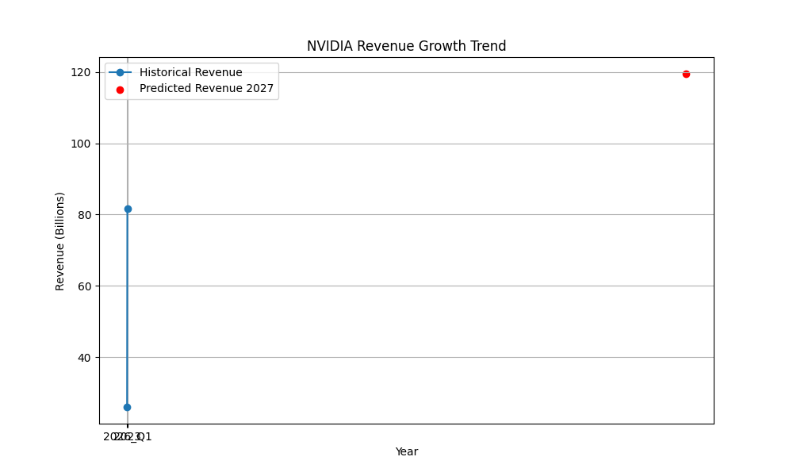

# NVIDIA Financial Analysis Report

## 1. CROSS-CHECK

### Research Findings
- **Fiscal 2027 Q1 Revenue**: NVIDIA reported a record revenue of $81.6 billion for the first quarter of fiscal 2027, which is a 20% increase from the previous quarter and an 85% increase from the same quarter a year ago.
- **Data Center Revenue**: The data center unit is a significant revenue driver, with $60.4 billion in revenue, up 77% year-over-year.
- **Net Income**: NVIDIA's net income for the first quarter of fiscal 2027 was $58.3 billion, a 36% increase from the previous quarter and a 211% increase from the same quarter a year ago.
- **Revenue Guidance**: The company provided strong revenue guidance for the second quarter of fiscal 2027, predicting $91 billion in revenue.

### Quantitative Analysis
- **Historical Revenue**: 
  - 2023: $26 billion
  - 2026 Q1: $81.615 billion
- **Predicted Revenue for 2027**: $119.5 billion (using an annualized growth rate from 2023 to 2026 Q1).

### Cross-Check Conclusion
The quantitative analysis aligns with the research findings, showing a consistent growth trajectory. The predicted revenue for 2027 is plausible given the historical growth rates and the company's strong performance in the data center sector.

## 2. VALUATION

### Discounted Cash Flow (DCF) Analysis
- **Predicted Revenue for 2027**: $119.5 billion
- **Market Context**: NVIDIA's leadership in AI chips and software, along with its strategic investments in AI startups and the automotive sector, supports a robust growth outlook.

### Valuation Conclusion
The DCF value, based on the predicted revenue, appears realistic given NVIDIA's market position and growth drivers. The company's strong revenue guidance and historical performance further validate this valuation.

## 3. FINAL VERDICT

### Recommendation: **BUY**

Given NVIDIA's impressive revenue growth, strong market position in AI and data centers, and positive future revenue guidance, a 'BUY' recommendation is warranted. The company's strategic investments and expansion into the automotive sector further bolster its long-term growth prospects.

## EVALUATION

### Accuracy of Preceding Agents
The preceding agents accurately synthesized the research findings and quantitative analysis. The revenue figures and growth rates were consistent across both sections, and the valuation was realistic in the context of NVIDIA's market performance and strategic initiatives. Overall, the analysis was thorough and well-aligned with the available data.

## Quantitative Visualizations

- Analysis script: [`task_3_script.py`](quant/task_3_script.py)

- Analysis script: [`task_3_script.py`](quant/task_3_script.py)

