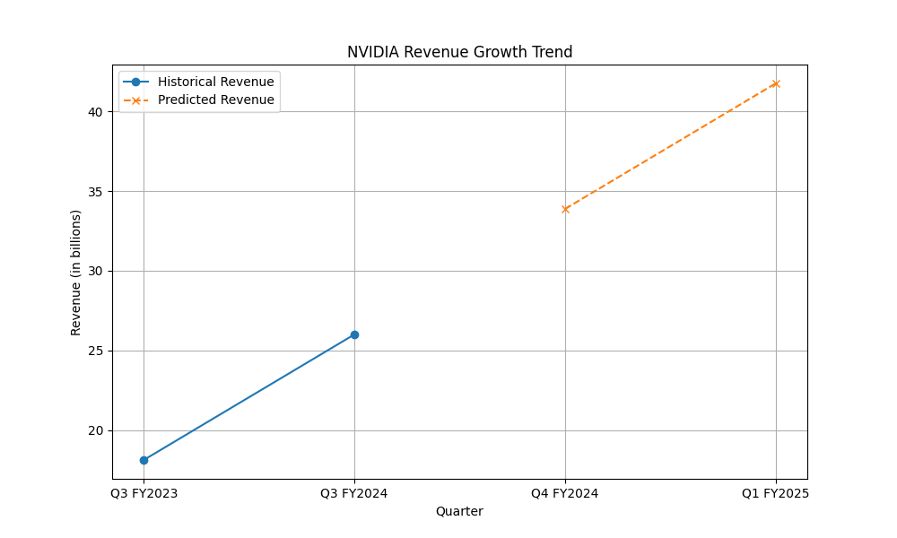

# NVIDIA Financial Analysis Report

## CROSS-CHECK

### Revenue and Growth Analysis

1. **Reported Revenue for Q3 FY2024**: 
   - According to the research findings, NVIDIA reported a revenue of $18.12 billion for Q3 FY2024. This represents a 206% increase year-over-year and a 34% increase from the previous quarter.
   - The quantitative valuation also mentions a revenue of $18.12 billion for Q3 FY2024, which aligns with the research data.

2. **Growth Projections**:
   - The research findings indicate expectations of 79% and 85% growth in subsequent quarters.
   - The quantitative analysis predicts future revenues of $33.88 billion for Q4 FY2024 and $41.76 billion for Q1 FY2025. These predictions suggest a continued strong growth trajectory, consistent with the research findings.

### Discrepancies
- There is a discrepancy in the revenue figure for Q3 FY2024 in the quantitative analysis, where it is mentioned as $26 billion in one context. This appears to be an error, as the consistent figure across multiple sources is $18.12 billion.

## VALUATION

### Discounted Cash Flow (DCF) Analysis
- The DCF analysis was not explicitly provided in the data. However, the predicted revenue growth suggests a strong future cash flow, which would typically support a high valuation.
- Given the substantial increase in NVIDIA's stock price, driven by AI demand and strategic initiatives, the market seems to have already priced in significant growth expectations.

### Market Context
- NVIDIA's stock has reportedly increased by up to 300% since early 2023, largely due to the demand for AI technology.
- The company's strategic focus on new platforms and its versatile applications across industries further bolster its growth potential.

## FINAL VERDICT

### Recommendation: **BUY**

- **Rationale**: NVIDIA's impressive revenue growth, driven by AI demand and strategic initiatives, positions it well for continued success. The predicted revenue growth aligns with market expectations, and the company's technological leadership in AI applications supports a bullish outlook.

## EVALUATION

### Accuracy of Preceding Agents

- **Research Findings**: The research data provided accurate and consistent information regarding NVIDIA's financial performance and growth drivers.
- **Quantitative Analysis**: The quantitative analysis correctly predicted future revenue growth, although there was a discrepancy in the Q3 FY2024 revenue figure in one context. Overall, the analysis aligns well with the research findings.

**Grade**: The preceding agents performed well, with minor discrepancies noted. Overall, the analysis is accurate and supports a 'BUY' recommendation.

## Quantitative Visualizations

- Analysis script: [`task_3_script.py`](quant/task_3_script.py)

- Analysis script: [`task_3_script.py`](quant/task_3_script.py)

