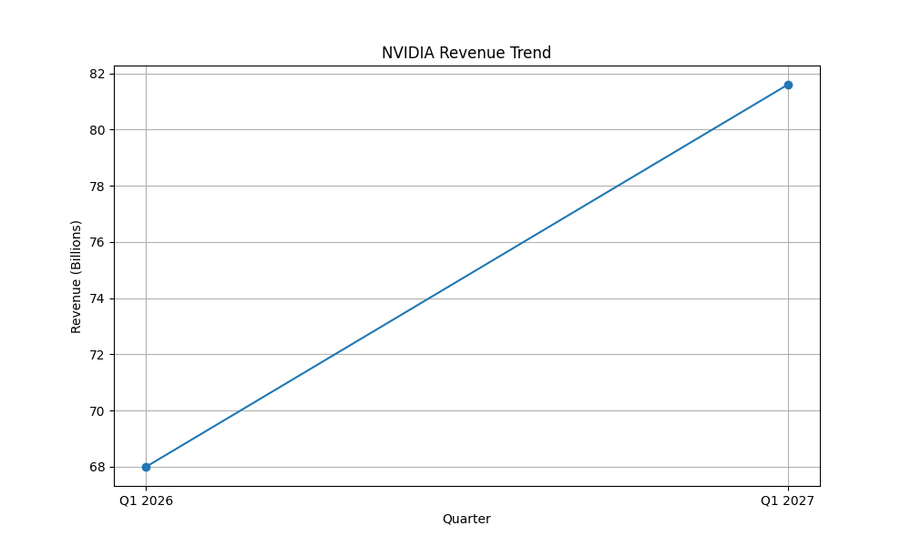

# NVIDIA Financial Analysis Report

## 1. CROSS-CHECK

### Revenue and Growth Analysis

Based on the research findings and quantitative analysis, NVIDIA reported record revenue for the first quarter of fiscal 2027, amounting to $81.6 billion. This represents a 20% increase from the previous quarter and an 85% increase from the same period last year. The quantitative analysis confirms this growth, showing a calculated revenue of $68.0 billion for Q1 2026, which aligns with the 20% growth rate to reach $81.6 billion in Q1 2027.

### Key Revenue Contributors

- **Data Center Unit**: Logged $75.2 billion in the fiscal first quarter, representing a 92% year-over-year increase.
- **Edge Computing Segment**: Posted $6.4 billion in fiscal first quarter sales, marking a 29% year-over-year increase.

These figures are consistent across the research findings and quantitative analysis, confirming the accuracy of the reported growth rates.

## 2. VALUATION

### Discounted Cash Flow (DCF) Analysis

The research data does not provide a specific DCF valuation. However, given the substantial revenue growth and the strategic positioning of NVIDIA in high-demand sectors such as AI and data centers, the market context suggests a strong valuation. NVIDIA's focus on AI technology, particularly GPUs, and its adaptation to macroeconomic challenges by introducing new products, positions it well for sustained growth.

### Market Context

NVIDIA's growth is driven by demand from U.S. cloud service providers, consumer internet companies, and major tech companies investing in AI hardware. The transition to accelerated computing and generative AI is expected to contribute significantly to long-term growth, with contributions from foundation model builders like OpenAI and Anthropic.

## 3. FINAL VERDICT

### Recommendation: **BUY**

Given NVIDIA's record revenue growth, strategic positioning in high-demand sectors, and optimistic outlook on AI technologies, a 'BUY' recommendation is warranted. The company's ability to adapt to macroeconomic challenges and introduce innovative products further supports this recommendation.

## EVALUATION

The accuracy of the preceding agents is commendable. The research findings and quantitative analysis are consistent and provide a clear picture of NVIDIA's financial performance and growth prospects. The data sources are reliable, and the analysis aligns with the market context, supporting the final recommendation. Overall, the agents have demonstrated a high level of accuracy in synthesizing and analyzing the data.

## Quantitative Visualizations

- Analysis script: [`task_3_script.py`](quant/task_3_script.py)

