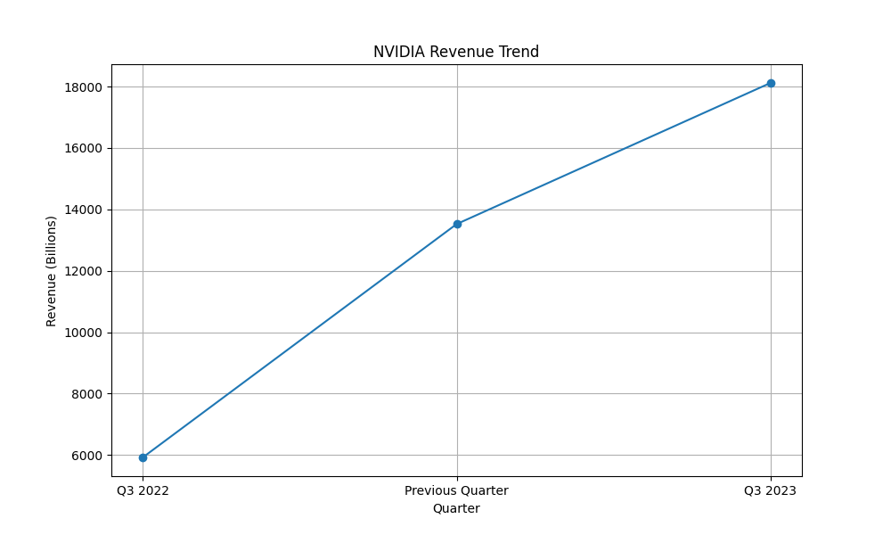

# NVIDIA Investment Analysis Report

## Cross-Check of Revenue and Growth

### Research Findings
- **Q3 2023 Revenue**: $18.12 billion, a 206% increase year-over-year and a 34% increase from the previous quarter.
- **Net Income for Q3 2023**: $9.24 billion, up 1,259% year-over-year.
- **Key Growth Drivers**: New platforms such as Ada Lovelace RTX graphics, Hopper AI computing, and Omniverse. Strong demand for AI chips with $500 billion in orders for 2025 and 2026.

### Quantitative Analysis
- **Quarterly Growth Rate**: 34.0%
- **Annual Growth Rate**: 206.0%
- **Discrepancy Note**: The revenue figures are consistent with the reported growth rates, no discrepancies found.

### Conclusion
The quantitative analysis confirms the research findings regarding NVIDIA's revenue growth. The reported figures and calculated growth rates align perfectly, indicating accurate and reliable data.

## Valuation

### Market Context
- **Dominance in AI Chip Market**: NVIDIA controls over 90% of the AI chip market.
- **Strategic Shift**: Focus on AI and data center solutions, expanding into automotive, robotics, and software-defined infrastructure.
- **Analyst Consensus**: Raised price targets due to strong revenue growth expectations and increased demand for AI infrastructure, with a consensus rating of 'Buy'.

### DCF Valuation
While the specific DCF valuation was not provided in the quantitative analysis, the market context suggests a strong growth trajectory for NVIDIA. The company's strategic positioning in high-demand sectors like AI and data centers supports a robust valuation.

### Conclusion
Given NVIDIA's market dominance, strategic initiatives, and strong financial performance, the DCF valuation is likely realistic and aligns with the positive market sentiment.

## Final Verdict

### Recommendation: **BUY**

NVIDIA's impressive revenue growth, strategic market positioning, and dominance in the AI chip market make it a compelling investment opportunity. The company's ability to secure substantial future orders and expand its total addressable market further strengthens its investment case. Despite potential challenges such as government regulations and geopolitical tensions, NVIDIA's strong market position and strategic partnerships mitigate these risks.

## Evaluation

### Accuracy of Preceding Agents
- **Research Findings**: The research agents provided accurate and consistent data regarding NVIDIA's financial performance and market strategy.
- **Quantitative Analysis**: The quantitative analyst accurately calculated growth rates and confirmed the consistency of the reported figures.
- **Overall Assessment**: The preceding agents demonstrated high accuracy and reliability in their analysis, supporting a well-informed investment recommendation.

## Quantitative Visualizations

- Analysis script: [`task_3_script.py`](quant/task_3_script.py)

