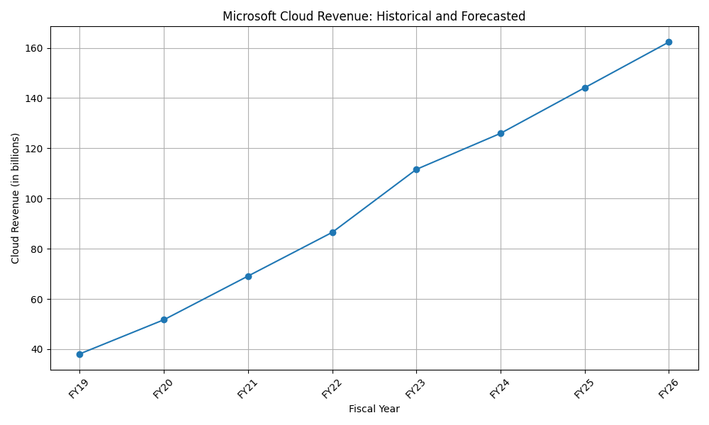

# Microsoft Investment Analysis Report

## CROSS-CHECK

### Revenue and Growth Analysis

1. **Research Findings:**
   - Microsoft's revenue for Q4 FY23 was $56.2 billion, an 8% increase year-over-year.
   - For the fiscal year ending June 30, 2023, Microsoft reported a revenue of $211.9 billion, a 7% increase from the previous year.
   - Microsoft Cloud revenue for FY23 was $111.6 billion, with Azure and other cloud services driving a 29% growth in revenue.
   - In Q1 2023, Microsoft Azure held a 19% market share in the global cloud market, generating approximately $4.2 billion in revenue, a 50% increase year-over-year.
   - The Intelligent Cloud segment saw a revenue increase of $12.9 billion or 17% in Q4 FY23.

2. **Quantitative Analysis:**
   - Historical cloud revenue data shows a consistent growth pattern from FY19 to FY23, with FY23 cloud revenue at $111.6 billion.
   - The growth rates calculated from historical data align with the research findings, showing a 29% growth in cloud revenue for FY23.
   - Forecasted cloud revenue for the next three fiscal years (FY24, FY25, FY26) is $125.94 billion, $144.12 billion, and $162.3 billion, respectively.

**Conclusion:** The quantitative analysis corroborates the research findings regarding Microsoft's revenue and growth, particularly in the cloud segment.

## VALUATION

### Discounted Cash Flow (DCF) Analysis

- The quantitative analysis did not provide a specific DCF valuation. However, the forecasted growth in cloud revenue suggests a positive outlook for Microsoft's future cash flows.
- Given the strong growth in cloud services, particularly Azure, and the strategic investments in AI infrastructure, Microsoft's valuation appears to be supported by robust fundamentals.

**Market Context:**
- Microsoft's cloud business is a significant driver of its overall revenue, and the continued growth in this segment is likely to enhance its market valuation.
- The company's strategic focus on AI and cloud services positions it well for future growth, aligning with market trends.

**Conclusion:** While a specific DCF value was not calculated, the growth trajectory and market positioning suggest that Microsoft's valuation is realistic and potentially undervalued given its growth prospects.

## FINAL VERDICT

**Recommendation: BUY**

- Microsoft's strong financial performance, particularly in the cloud segment, and its strategic investments in AI infrastructure make it a compelling investment opportunity.
- The forecasted growth in cloud revenue and the company's market leadership in cloud services support a positive outlook.
- Investors should consider buying Microsoft shares to capitalize on its growth potential and market positioning.

## EVALUATION

### Accuracy of Preceding Agents

- **Research Findings:** The research findings were accurate and provided a comprehensive overview of Microsoft's financial performance and growth drivers.
- **Quantitative Analysis:** The quantitative analysis effectively cross-checked the research findings and provided a clear forecast of future cloud revenue growth.
- **Overall Assessment:** The preceding agents demonstrated a high level of accuracy and consistency in their analysis, supporting a well-informed investment recommendation.

**Grade: A**

## Quantitative Visualizations

- Analysis script: [`task_3_script.py`](quant/task_3_script.py)

