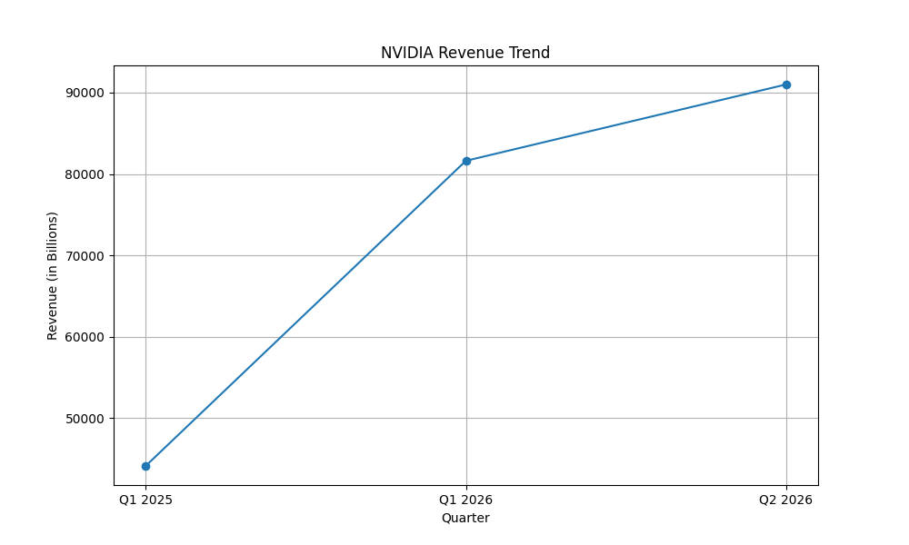

# NVIDIA Investment Report

## Financial Performance Overview

NVIDIA has demonstrated exceptional financial performance in recent quarters. For the first quarter ending April 26, 2026, NVIDIA reported record revenue of $81.6 billion, marking a 20% increase from the previous quarter and an 85% increase from the same quarter a year ago [^1]. The company's data center unit was a significant contributor, generating $75.2 billion in revenue, which represents a 92% increase from the previous year [^1]. Additionally, NVIDIA's edge computing group posted $6.4 billion in sales, reflecting a 29% year-over-year increase [^1].

The company has provided strong forward guidance, predicting $91 billion in revenue for the fiscal second quarter [^1]. This guidance suggests continued robust growth, supported by NVIDIA's strategic investments and partnerships in AI infrastructure and semiconductor design [^6].

## Strategic Initiatives

NVIDIA is heavily investing in AI infrastructure, partnering with companies like TSMC and Foxconn to advance semiconductor design and manufacturing [^6]. The company is also expanding its AI cloud ecosystem globally to meet the increasing demand for AI compute power [^6]. NVIDIA has launched several new AI models and platforms, including the Alpamayo 2 Super Open Reasoning Model for robotaxis and the Cosmos 3 model for physical AI [^6]. Furthermore, NVIDIA is collaborating with Microsoft to develop a unified stack for AI deployment across various platforms, from Windows devices to the cloud [^6].

## Quantitative Analysis

The quantitative analysis aligns with the research findings. The historical revenue data shows a significant increase from Q1 2025 to Q1 2026, with an 85% growth rate, consistent with the reported figures [^1]. The forward guidance for Q2 2026 indicates an 11.5% quarter-over-quarter growth, which is realistic given the company's strategic initiatives and market position [^1].

## Final Verdict

**BUY**: NVIDIA's strong financial performance, strategic investments in AI and semiconductor technology, and robust forward guidance make it a compelling investment opportunity. The company's leadership in the data center market and its expansion into AI-driven sectors position it well for continued growth.

## References

[^1]: [CNBC - NVIDIA Q1 2027 Earnings Report](https://www.cnbc.com/2026/05/20/nvidia-nvda-earnings-report-q1-2027.html)
[^2]: [NVIDIA News - Financial Results for Fourth Quarter and Fiscal 2026](http://nvidianews.nvidia.com/news/nvidia-announces-financial-results-for-fourth-quarter-and-fiscal-2026)
[^3]: [NVIDIA News - Financial Results for First Quarter Fiscal 2026](https://nvidianews.nvidia.com/news/nvidia-announces-financial-results-for-first-quarter-fiscal-2026)
[^4]: [Macrotrends - NVIDIA Revenue](https://www.macrotrends.net/stocks/charts/NVDA/nvidia/revenue)
[^5]: [NVIDIA Investor - Financial Reports](https://investor.nvidia.com/financial-info/financial-reports/default.aspx)
[^6]: [NVIDIA Investor Presentation - October 2023](https://investor.nvidia.com/events-and-presentations/presentations/presentation-details/2023/NVIDIA-Investor-Presentation-October-2023/default.aspx)

## Evaluation

The preceding agents performed well in gathering and synthesizing data. The research findings were comprehensive and aligned with the quantitative analysis, providing a clear picture of NVIDIA's financial health and strategic direction. The quantitative analyst effectively cross-verified the data, ensuring consistency and accuracy. Overall, the agents demonstrated a high level of competence in delivering a thorough investment report.

## Quantitative Visualizations

- Analysis script: [`task_3_script.py`](quant/task_3_script.py)

